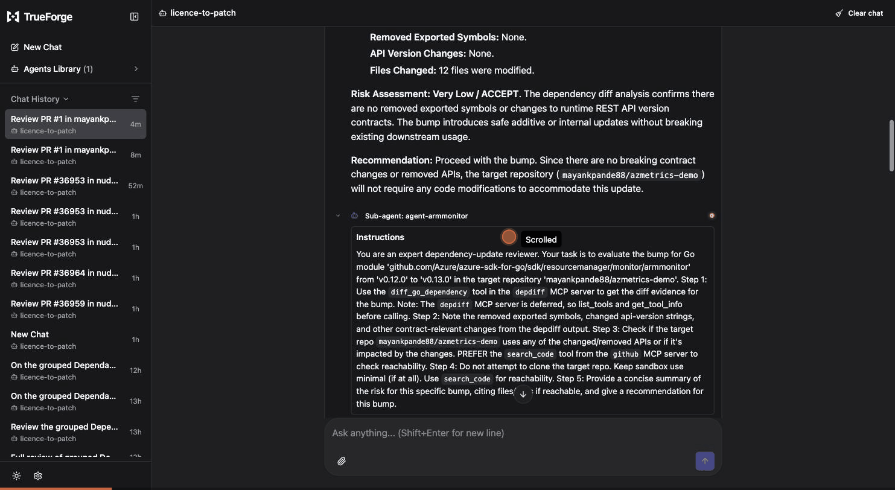

# Licence to Patch

A dependency-update **trust agent**, built on the open-source [TrueForge](https://github.com/truefoundry/trueforge) harness.

Dependabot and Renovate open a flood of update PRs, and grouped PRs bundle several bumps at once. Teams rubber-stamp or ignore them because they can't tell which bump is safe. The dangerous ones aren't the updates that break your tests — CI already catches those. They're the **behavioral / contract changes that pass green CI and break production**: a changed default, a new retry policy, a baked-in REST api-version the live service rejects.

*Licence to Patch* reviews a (grouped) Dependabot PR, tells you which bump you can trust, and — only behind a human approval gate — fixes the one you can't.

> Licence to patch — but only with your signature.

## The story

A routine Dependabot bump — an Azure SDK for Go update — quietly broke a production service of mine, and it took weeks to find. There was no error anyone could see: CI was green, every test passed, the PR looked completely safe. But the SDK had silently changed the REST `api-version` it sends (`2024-03-01-preview` → `2026-01-01`), and the live service began rejecting the calls at runtime. Nothing in *my* code had changed, and it wasn't in the changelog — the only place the change existed was the dependency's **source**, between two versions.

That repo gets a pile of grouped Dependabot PRs every week, each bundling several bumps. After the outage the instinct was to stop merging them — but you can't stop taking security and patch updates, and no one can hand-verify every bump in every group. What was missing was a confident, non-manual way to tell which bump is safe and which is a silent landmine. That's the job I wanted to hand to an agent. This is it.

## See it in action

One bare prompt — `Review PR #N` — and the agent reads the PR, fans out a sub-agent per bump, diffs each dependency's source, searches the repo for where the changed symbols are actually used, posts a trust brief, and pauses for your approval before touching code:



## The wedge: "green CI ≠ safe"

The method is **diff the source, not the changelog.** Between the current and target versions the detector surfaces contract-relevant changes a changelog omits — a changed baked-in constant *value* (a default timeout, an endpoint, a retry count, an enum, a REST api-version) or a removed exported function.

The motivating case is real: `armmonitor` (Azure SDK for Go) v0.12.0 → v0.13.0 silently changed a metric-alert REST api-version from `2024-03-01-preview` to `2026-01-01`, which ARM rejects at runtime — invisible to the compiler, a mocked test suite, reachability scanners, and the changelog alike.

That api-version detector is **one heuristic**, and a deliberately narrow, high-precision one (it keys off Azure's `Set("api-version", …)` idiom). The general layer is the **agent**: it diffs the source, reads the changelog, searches for call sites, verifies in a sandbox, and asks a human before it changes code — and it applies that across ecosystems, proven on **Go, Python, and npm**. The deterministic tools are grounding; the judgment is the agent's.

## What it does

Given a grouped Dependabot PR, the agent:

1. **Reads the PR** (GitHub MCP) and lists every bump.
2. **Analyses each bump.** For Go it runs `depdiff` (source diff → changed constant values, an api-version heuristic, removed exported functions). For other ecosystems it does the equivalent in the sandbox.
3. **Verifies in the sandbox** that the bumped code still builds and its tests pass — proving CI *would* be green, live.
4. **Posts a per-bump trust brief** as a PR comment — ACCEPT / CAUTION / HOLD, each with *what changed / why it matters / recommendation*. This is advisory, so it posts without stopping.
5. **Fixes the unsafe bump — behind a human gate.** For a HOLD it proposes a concrete fix; the harness pauses for your Allow/Deny before it changes anything, then either drives Dependabot to rebuild the group without the module, or reverts the bump on the branch directly.

The approval gate is on the **fix**, not the comment: posting a review is advice; changing the code is the irreversible act.

## Architecture

```
                 TrueForge harness (loop · approvals · sandbox · session · subagents)
                                          │
     ┌───────────┬───────────┬───────────┼───────────────┬──────────────────────┐
 github (MCP)  depdiff(MCP) sandbox    review (MCP)    fix (MCP)             verdict (hint)
 read the PR   diff a Go    go build   post the trust  revert_bump_on_pr     deterministic
 & its bumps   dep's source + go test  brief comment   (edit branch) OR      ACCEPT/CAUTION/
               → evidence   (green CI  (ADVISORY —     hold_via_dependabot   HOLD as a hint;
               (facts +     live)      ungated)        (@dependabot ...)     the AGENT reasons
               hint)                                                         & writes the brief
                                                       → GATED (human
                                                         approves the fix)
```

The custom code is small; the harness does the heavy lifting (tool loop, sandboxed execution, the human-approval pause, subagents, session state).

## How the approval gate is placed

The gate belongs on the code-changing fix, not on posting a comment. The right lever in TrueForge is **per-connector `require_approval_for_tools`** in the agent spec — not tool annotations. (An un-annotated MCP tool does *not* become ungated: MCP defaults tools to `destructiveHint: true`, so it would still pause.) The provided saved agent gates only the `fix` connector and leaves `review` / `depdiff` / `github` ungated:

```jsonc
"mcp_servers": [
  { "name": "depdiff", "require_approval_for_tools": [] },
  { "name": "github",  "require_approval_for_tools": [] },
  { "name": "review",  "require_approval_for_tools": [] },   // advisory comment — no gate
  { "name": "fix",     "require_approval_for_tools": ["@all"] } // code change — gated
]
```

## Components

- `cmd/depdiff-mcp` — MCP server: `diff_go_dependency(module, from, to)`. Downloads both versions, diffs the source, and returns **evidence**: changed constant values (AST-level, any baked-in value), an api-version heuristic, removed exported functions, files-changed count, and a *preliminary* verdict as a hint. It deliberately does **not** return a finished recommendation — reasoning about which changes this repo actually uses, weighing the tests, and writing the brief is the agent's job. Read-only.
- `cmd/review-mcp` — MCP server: `post_pr_review(owner, repo, pull_number, event, body)`. Advisory (ungated via the agent's policy).
- `cmd/fix-mcp` — MCP server, the gated code-changing actions: `revert_bump_on_pr` (clone the PR branch, pin the module back, `go mod tidy`, commit, push) and `hold_via_dependabot` (comment `@dependabot ignore <module>` + `@dependabot recreate`).
- `internal/depdiff` · `internal/verdict` · `internal/brief` — detection core, ACCEPT/CAUTION/HOLD classifier, and the *what/why/recommendation* renderer. The renderer is used only by the standalone `tools/depdiff` CLI (a human runs it directly); in the agent path the agent writes the brief itself from the tool's evidence.
- `internal/ghreview` · `internal/fix` — GitHub reviews/comments client and the branch-revert logic.
- `tools/depdiff` — the detection core as a CLI.

Every write server binds to loopback, reads its token from `GITHUB_TOKEN` (never the model or sandbox), validates inputs, and refuses a non-loopback bind without `-allow-remote`.

## Multi-language

The deterministic `depdiff` tool targets Go, where the source-diff detector lives (changed constant values, an api-version heuristic, removed exported functions). The *technique* — "diff the source, not the changelog" — is language-agnostic, and the agent applies it in the sandbox to any ecosystem. Two full demos plus a live proof:

- **Go** — [`azmetrics-demo`](https://github.com/mayankpande88/azmetrics-demo): `armmonitor` 0.12 → 0.13 flips a baked-in api-version ARM rejects. Analysed by the `depdiff` tool.
- **Python** — [`pyconfig-demo`](https://github.com/mayankpande88/pyconfig-demo): `PyYAML` 5.3 → 6.0 makes `yaml.load`'s `Loader` argument required, so `load_config` raises `TypeError` at runtime while the tests (which cover a different function) stay green. Analysed by the agent in the sandbox.
- **npm / React** (live technique proof) — `node-fetch` 2 → 3 goes ESM-only (`"type": "module"`), so `require()` throws `ERR_REQUIRE_ESM` at runtime.

## Try the detector (no setup)

```
go run ./tools/depdiff github.com/Azure/azure-sdk-for-go/sdk/resourcemanager/monitor/armmonitor v0.12.0 v0.13.0
```

You'll see the api-version change in `metricalerts_client.go` (`2024-03-01-preview` → `2026-01-01`), a HOLD verdict, and the review-ready explanation.

## Run the agent (TrueForge)

1. Start TrueForge: `npx @truefoundry/trueforge` (Node ≥ 22.14) → http://localhost:8790
2. Settings → Models: add a provider (any — it's model-neutral). Settings → Sandbox providers: add Daytona.
3. Start the three MCP servers (each on loopback) with one script — it reads the GitHub token from a gitignored file (`~/.config/lp/github_token`), never the model or sandbox:
   ```
   ./scripts/run-mcp-servers.sh
   ```
4. Settings → Connectors: add each MCP URL (`http://localhost:897{1,2,3}/mcp`, No auth), and the shipped **github** connector with a fine-grained PAT (Contents: read, Pull requests: read & write).
5. Create the saved agent from the committed manifest — this is the exact agent used in the demo (model, instructions, and the per-connector approval policy that gates only `fix`):
   ```
   curl -X POST http://localhost:8790/api/v1/agents -H 'Content-Type: application/json' -d @agent.json
   ```
   Open a session on it and ask it to review a grouped Dependabot PR (e.g. `Review PR #N in owner/repo`). The trust brief posts; the fix pauses for your approval. The agent's [`instructions`](agent.json) are the reasoning logic — the deterministic tools only provide evidence.

## Reproduce it yourself

**1. Verify the detector — zero setup, no accounts** (this alone confirms the core claim):
```
go run ./tools/depdiff github.com/Azure/azure-sdk-for-go/sdk/resourcemanager/monitor/armmonitor v0.12.0 v0.13.0
```
Prints the api-version change and a HOLD. Works on any public Go module; needs only Go.

**2. Run the full agent** — bring your own: a model provider (any; `agent.json` pins Gemini — change the one `model.name` line to use another), a **Daytona** sandbox key, and a GitHub **fine-grained PAT** (Contents: read, Pull requests: read & write). Then follow *Run the agent* above.

**3. Drive the write flow on a PR you own.** The demo repos below are *mine*, so your token can't post/patch on them. To see the trust brief + gated fix end-to-end, **fork a fixture (or use any Go repo), let Dependabot open a grouped PR, and point the agent at your PR**:
- Fork [`azmetrics-demo`](https://github.com/mayankpande88/azmetrics-demo), enable Dependabot (the grouped `.github/dependabot.yml` ships with it), then `Review PR #N in <you>/azmetrics-demo`.
- Reading/analysis works on *any* public repo without a fork; only posting a comment or pushing a fix needs write access.

## Demo targets

- [mayankpande88/azmetrics-demo](https://github.com/mayankpande88/azmetrics-demo) — Go, the `armmonitor` api-version landmine.
- [mayankpande88/pyconfig-demo](https://github.com/mayankpande88/pyconfig-demo) — Python, the `PyYAML` `yaml.load` landmine.

Both ship a real grouped Dependabot PR whose green test suite is blind to the breaking change.

---

Built for the WeMakeDevs × TrueFoundry Agent Harness Hackathon. MIT-licensed, open source.
